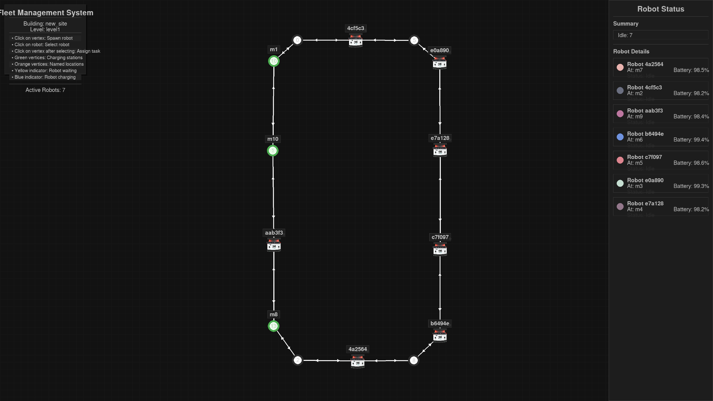
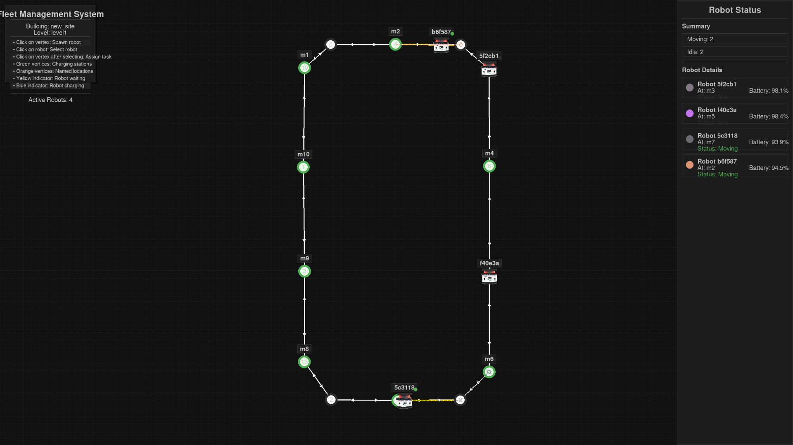

# Fleet Management System with Traffic Negotiation for Multi-Robots

A visually intuitive and interactive Fleet Management System using Python and Pygame, capable of managing multiple robots simultaneously navigating through an environment with collision avoidance and traffic negotiation.

## Features

- **Environment Visualization**: Interactive display of vertices (locations) and lanes (connections) from navigation graphs
- **Robot Spawning**: Click on any vertex to spawn a robot with unique identifier
- **Task Assignment**: Select a robot and click on a destination vertex to assign navigation tasks
- **Real-time Visualization**: Dynamic movement of robots along lanes with smooth animation
- **Status Indicators**: Color-coded visual indicators for robot status:
  - 🟢 Moving
  - 🟡 Waiting/Queued
  - 🔴 Charging
  - ⚪ Task Complete
- **Traffic Management**: Automatic collision avoidance and lane negotiation
- **Charging Stations**: Special marked locations for robot recharge
- **Logging System**: Detailed activity logging in `fleet_logs.txt`

## Installation

1. Clone the repository:
```bash
git clone https://github.com/Yuvaneshwarran/fleet_management_system.git
cd fleet_management_system
```

2. Install dependencies:
```bash
pip install -r requirements.txt
```

## Usage

Run the main application:
```bash
python src/main.py
```

To specify a different navigation graph:
```bash
python src/main.py --graph data/nav_graph_2.json
```

## Interaction Guide

| Action | How To |
|--------|--------|
| **Spawn Robot** | Click on any vertex (location) |
| **Select Robot** | Click on an existing robot |
| **Assign Task** | First select robot, then click destination vertex |
| **View Details** | Hover over robots/vertices for tooltips |

## Project Structure

```
fleet_management_system/
├── data/
│   ├── nav_graph_1.json  # Default environment
│   ├── nav_graph_2.json  # Alternative map 1
│   └── nav_graph_3.json  # Alternative map 2
├── src/
│   ├── models/
│   │   ├── nav_graph.py  # Graph parsing and representation
│   │   └── robot.py      # Robot behaviors and attributes
│   ├── controllers/
│   │   └── fleet_manager.py  # Core coordination logic
│   ├── gui/
│   │   └── fleet_gui.py      # Pygame visualization system
│   ├── utils/
│   │   └── helpers.py        # Pathfinding and utilities
│   └── main.py               # Application entry point
├── logs/
│   └── fleet_logs.txt        # Activity logs
├── requirements.txt          # Python dependencies
└── README.md                 # This document
```

## Technical Details

* **Pathfinding**: Dijkstra's algorithm for optimal route calculation
* **Collision Avoidance**: Priority-based lane reservation system
* **Visualization**: Pygame-based rendering with 60 FPS smooth animation
* **Coordinate System**: Mercator projection for accurate positioning

## Screenshots
*Robots spawning in the nodes*

*Main interface showing robots navigating between locations*


## Demo Video

https://github.com/user-attachments/assets/6edd32bb-d0a9-4656-a73d-40998aabbe33


